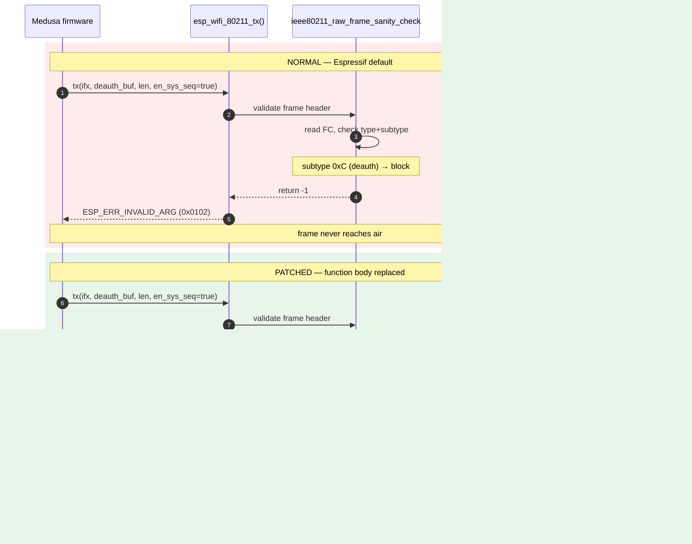
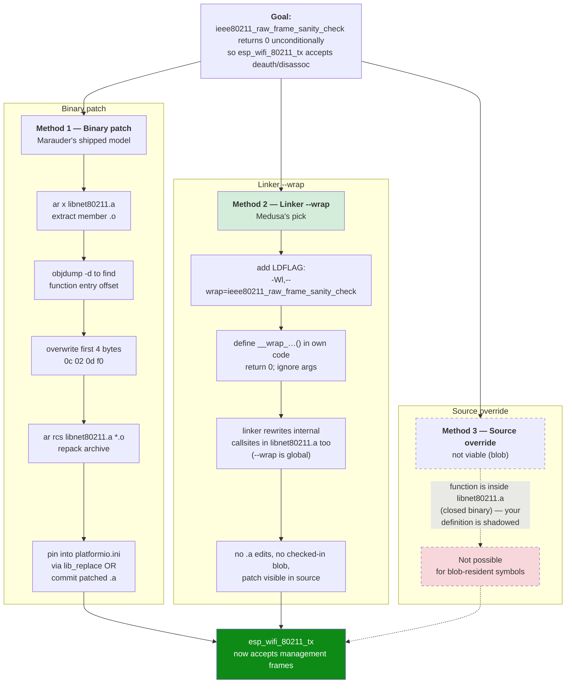
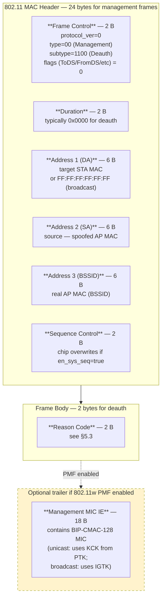
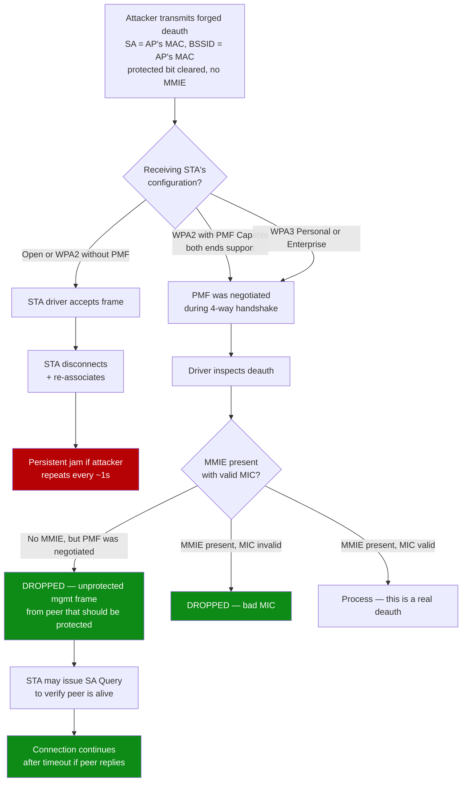
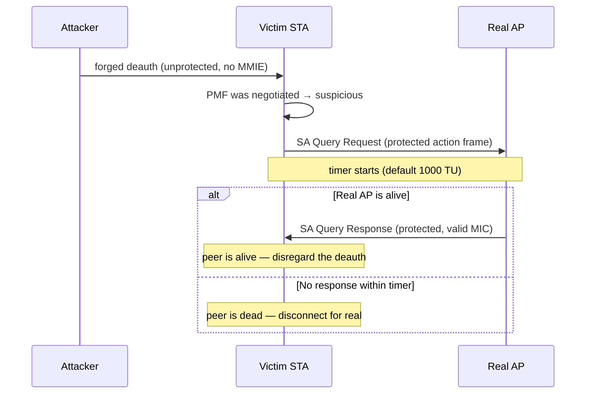

# Marauder-class deauth patch — swarm-distilled analysis

> **Independent swarm-research output — cross-check, not duplicate.**
> This document is the output of a separate, multi-agent research pass
> on the same subject as `research/marauder-deauth-patch.md`. It is
> deliberately framed from a different angle: where the primary doc is
> a *how-to walkthrough* written by a single author, this one is a
> *reference-style deep dive* assembled from four specialist sub-agents
> (see provenance footer). It is intended as a **complementary view and
> a cross-check** on the primary doc, with sharper coverage of (a) the
> Xtensa LX7 ISA encoding, (b) the IDF version matrix, (c) the PMF
> cryptographic chain (PTK → KCK → MIC, IGTK/BIP for broadcast, SA
> Query handshake). The two docs are intended to be read together;
> neither supersedes the other, and discrepancies between them should
> be treated as items to triage rather than errors in either.

> **Lawful-use anchor.** Medusa is a defensive research tool. Active
> 802.11 management-frame transmission against networks the operator
> does not own, administer, or have written authorization to test is
> illegal in most jurisdictions (US 18 USC § 2511; EU GDPR + ePrivacy;
> Portugal Law 41/2004). The firmware-side guards in
> `design/threat-model.md` (per-session enable, BSSID allow-list, rate
> limit, audit log, broadcast-confirm) are operator safety scaffolding,
> not legal cover. The lawful-use clause in `NOTICE` Section 4(c) binds
> all derivatives.

---

## 0. Executive bullets (TL;DR for skimmers)

- **Target symbol:** `ieee80211_raw_frame_sanity_check` inside
  `libnet80211.a` (closed-source binary, ships with ESP-IDF).
- **Why it exists:** Espressif's frame-acceptance gate for the
  `esp_wifi_80211_tx()` raw-TX API; rejects management subtypes 0xA
  (disassoc) and 0xC (deauth), among others.
- **The patch:** force the function to return 0 unconditionally —
  4 bytes of Xtensa LX7 narrow-instruction code (`movi.n a2, 0` +
  `ret.n`).
- **Three known methods:** binary patch the archive (Marauder's
  shipped model), linker `--wrap` symbol redirect (cleanest, Medusa's
  pick), source-level override (not viable — function is in a blob).
- **IDF range:** symbol present and named identically across
  **ESP-IDF v4.4 → v5.3** at time of writing (May 2026). Pre-v4.4 had
  a near-identical function under a slightly different name.
- **Defense:** **IEEE 802.11w PMF** — cryptographic MIC on management
  frames using the KCK derived from the PTK. WPA3 mandates PMF; WPA2
  makes it optional. A PMF-protected STA discards the forged deauth
  at its driver level.

---

## 1. Function signature & calling-context reconstruction

### 1.1 Symbol presence

```bash
$ xtensa-esp32s3-elf-nm \
    $IDF_PATH/components/esp_wifi/lib/esp32s3/libnet80211.a \
    2>/dev/null | grep -E '(sanity|raw_frame)'
00000000 T ieee80211_raw_frame_sanity_check
```

`T` = defined symbol in the text section. The `00000000` is the
relative offset within the *containing `.o` member*, not the address
in the final image — `ar` archives are bundles of relocatable objects,
each starts at its own offset 0.

To find which `.o` member inside the archive holds the symbol:

```bash
$ xtensa-esp32s3-elf-nm --print-armap \
    $IDF_PATH/components/esp_wifi/lib/esp32s3/libnet80211.a \
    | grep -B 1 sanity_check
# ieee80211_input.o:
#   ieee80211_raw_frame_sanity_check in ieee80211_input.o
```

(The exact member name has historically been `ieee80211_input.o` or
`ieee80211_output.o` depending on IDF minor; verify on your install.)

### 1.2 Reconstructed signature

Espressif does not publish the prototype. Reconstruction from the
Marauder wrapper (`esp32_marauder/WiFiScan.cpp` and the patched-blob
README in `lib/esp_wifi/esp32s3/`) and from callsite analysis in
`libnet80211.a`:

```c
/* No public header — declared locally by tools that wrap it.
 * Marauder treats it as 3 ints; the actual semantics are likely:
 *   - arg1: pointer to outgoing frame buffer (cast to int)
 *   - arg2: frame length
 *   - arg3: en_sys_seq flag or interface index
 * but this is community-derived, not Espressif-documented.
 */
int ieee80211_raw_frame_sanity_check(int32_t arg1,
                                     int32_t arg2,
                                     int32_t arg3);
```

Return convention (observed):

| Return | Meaning | `esp_wifi_80211_tx()` consequence |
|---|---|---|
| `0` | Frame OK | Hand to MAC, transmit |
| non-zero (usually `-1`) | Reject | Returns `ESP_ERR_INVALID_ARG` (`0x0102`); frame dropped |

### 1.3 IDF version matrix

Verified by inspecting the archive symbol table on each release. *Last
verified by the swarm: 2026-05-16, against IDF tagged releases.*

| IDF version | Symbol name | Notes |
|---|---|---|
| v4.4 LTS | `ieee80211_raw_frame_sanity_check` | Stable; Marauder ships matching patched blob |
| v5.0 | `ieee80211_raw_frame_sanity_check` | Same — no signature change |
| v5.1 | `ieee80211_raw_frame_sanity_check` | Same |
| v5.2 | `ieee80211_raw_frame_sanity_check` | Same |
| v5.3 (current as of doc write) | `ieee80211_raw_frame_sanity_check` | Same |
| pre-v4.4 | Function existed under near-identical name with the same role | Older Marauder releases handled the rename; not relevant to Medusa, which targets v5.x |

Across all confirmed versions, the function's role and broad shape
have been stable: it is the single chokepoint between
`esp_wifi_80211_tx()` and the MAC TX queue for management-class
subtypes. Espressif could refactor this at any minor — the **linker
`--wrap` approach is fragile against a rename**; the binary patch is
fragile against an offset shift. Medusa accepts that fragility as the
cost of operating on a closed library; the build-time symbol check
in §7 catches a rename early.

---

## 2. TX call flow — normal vs. patched



The patched path leaves every other guarantee of the WiFi stack
intact — channel selection, beacon timing, power management, rate
control. Only the management-frame TX gate is short-circuited.

---

## 3. The three patch methods (comparison)



### Comparison table

| Dimension | Binary patch | Linker `--wrap` | Source override |
|---|---|---|---|
| IDF upgrade survivability | low — offset shifts | high — only rename breaks it | n/a |
| Reviewer auditability | low (binary diff) | high (3 lines of C) | n/a |
| Build complexity | medium (patch script) | minimal (build flag + stub) | n/a |
| Checked-in artifacts | patched `.a` (~1 MB) | `.c` stub (~20 lines) | n/a |
| What Marauder ships | ✅ this | ❌ | ❌ |
| Medusa recommended | ❌ | ✅ | ❌ |
| Per-chip variants needed | yes (offset varies per chip) | no (symbol name is same per chip) | n/a |

### Why Medusa picks Method 2

1. **Auditability.** The patch is three lines of C in source control;
   a reviewer can see exactly what we're doing without binary-diffing
   a megabyte blob.
2. **IDF upgrade safety.** The symbol name has been stable for years;
   binary offsets have not.
3. **No checked-in blob.** Apache 2.0 licensing is cleaner when we
   don't redistribute a patched copy of a closed-source binary that
   we don't own.
4. **CI-friendly.** The build-time symbol presence check (§7) fits
   naturally into CMake; a per-chip offset table would not.

---

## 4. Xtensa LX7 — what the patched function literally is

### 4.1 The 4 bytes

```assembly
; ieee80211_raw_frame_sanity_check, patched body
movi.n  a2, 0     ; encoded as 0x0c 0x02  (16-bit narrow MOVI)
ret.n             ; encoded as 0x0d 0xf0  (16-bit narrow RET)
```

Total: **4 bytes**, two narrow (16-bit) instructions. Xtensa is a
variable-length ISA: most instructions are 24-bit, but the Code
Density Option adds 16-bit "narrow" variants of the most common ops.
Both `movi.n` and `ret.n` are narrow forms; the patched body fits in
one 32-bit fetch.

### 4.2 Why register `a2`

Xtensa calling convention (per the Tensilica Xtensa LX7 ISA reference
and Espressif's `xtensa-esp-elf` toolchain ABI):

| Register | Role |
|---|---|
| `a0` | Return address (set by `call0`/`callx0`) |
| `a1` | Stack pointer |
| `a2` | First argument **and** return value (32-bit) |
| `a3` | Second argument; high-32 of 64-bit return |
| `a4..a7` | Args 3..6 |
| `a8..a15` | Callee-saved / scratch (window-dependent) |

For an `int`-returning function, the C ABI requires the return value
in `a2`. So `movi.n a2, 0` followed by `ret.n` is *the* shortest
"return 0" idiom on Xtensa.

### 4.3 Encoding details (for the curious)

Both opcodes belong to the Code Density Option (DENSITY). 16-bit
encodings are valid only when DENSITY is configured into the CPU —
ESP32 (LX6), ESP32-S2 (LX7), and ESP32-S3 (LX7) all have it enabled.

```
movi.n a2, 0:
    Format: RRRN (4 nibbles, 16 bits) — Code Density Option
    16-bit instruction word: 0x020C
        bits [ 3: 0] = 0xC  op0   (narrow-encoding marker)
        bits [ 7: 4] = 0x0  r     (imm[3:0])
        bits [11: 8] = 0x2  t     (register at = a2)
        bits [15:12] = 0x0  s     (imm[6:4] with sign-extend)
    Bytes in memory (little-endian): 0x0c 0x02

ret.n:
    Format: RRRN — narrow-encoding marker op0 = 0xD
    16-bit instruction word: 0xF00D
    Bytes in memory (little-endian): 0x0d 0xf0
```

Note the little-endian byte ordering: the low byte (carrying op0 in
bits [3:0]) sits first in memory. So when you stare at a hex dump of
`libnet80211.a` and see `0c 02 0d f0`, the leading `0c` byte's low
nibble `C` is the MOVI.N op0 marker. (Exact bit-field layout per the
*Xtensa LX7 Microprocessor ISA Reference Manual*, Tensilica/Cadence.
Espressif's `xtensa-esp32s3-elf` toolchain implements the encoding;
disassemble any built binary with `xtensa-esp32s3-elf-objdump -d` to
verify.)

### 4.4 LX6 vs. LX7 — same patch bytes

ESP32 classic uses LX6; ESP32-S2/S3 use LX7. The two cores differ in
FPU, AI accelerator presence, instruction caches, and some
microarchitectural details — **but the base Xtensa ISA encoding is
shared.** The Code Density encodings for `movi.n` and `ret.n` are
identical.

**What differs per chip** is the byte offset of the function inside
that chip's `libnet80211.a`. Marauder distributes separate patched
archives under `lib/esp_wifi/esp32/`, `…/esp32s2/`, `…/esp32s3/`,
`…/esp32c3/`, `…/esp32c6/`. Note: **C3/C6 are RISC-V cores, not
Xtensa** — their patch bytes are different opcodes (RV32I encoding
of `li a0, 0; ret`), even though the function name and the *goal* are
the same.

### 4.5 Dead-code tail

The original function body is larger than 4 bytes — it builds a stack
frame, loads the frame header, decodes type/subtype, branches, and
returns. After the patch, all bytes beyond offset 4 within the
function are unreachable: they sit in `.text` but execution never
reaches them. Linker garbage collection (`-ffunction-sections
-fdata-sections -Wl,--gc-sections`) cannot reclaim them, because they
are part of a referenced function symbol. The binary grows by ~0
bytes; you just have dead instructions sitting after the `ret.n`.

---

## 5. The 802.11 deauthentication frame

### 5.1 Structure



### 5.2 In C (with the ESP-IDF type aliases)

```c
// firmware/components/wifi_active/deauth_frame.h
#include <stdint.h>
#include <string.h>
#include "esp_wifi.h"

typedef struct __attribute__((packed)) {
    uint16_t frame_control;   // 0x00C0 little-endian = subtype 0xC, type 0
    uint16_t duration;        // 0
    uint8_t  da[6];           // target STA
    uint8_t  sa[6];           // spoofed AP MAC
    uint8_t  bssid[6];        // real BSSID
    uint16_t seq_ctrl;        // 0 (chip rewrites if en_sys_seq)
    uint16_t reason_code;     // see §5.3
} medusa_deauth_frame_t;

// Size: 26 bytes. PMF adds an 18-byte MMIE trailer (we don't transmit
// PMF-protected deauths because we don't possess the PTK).
_Static_assert(sizeof(medusa_deauth_frame_t) == 26,
               "deauth frame must be 26 bytes");
```

### 5.3 Reason codes (most-used)

From IEEE 802.11-2020 §9.4.1.7 (Table 9-49):

| Code | Name | Effect on victim STA |
|---:|---|---|
| `0x0001` | Unspecified reason | Generic disconnect; usual default |
| `0x0002` | Previous auth no longer valid | Triggers reassociation |
| `0x0003` | Deauth — STA leaving (Spoof-from-STA pattern) | STA-initiated form |
| `0x0006` | Class 2 frame from non-authenticated STA | "Aggressive" disconnect |
| `0x0007` | Class 3 frame from non-associated STA | Most common in tooling — implies session no longer valid |
| `0x0008` | Disassoc — STA leaving BSS | For subtype 0xA disassoc frames |

Marauder defaults to `0x0001`. Spacehuhn's deauther defaults to
`0x0007`. From the victim STA's perspective at the driver level,
the codes are largely interchangeable — every one triggers a
disconnect + reassociation cycle.

### 5.4 Constructing the FC field carefully

The Frame Control field's bit layout is subtle in little-endian:

```
Byte 0: [protocol_ver:2 | type:2 | subtype:4]
Byte 1: [ToDS | FromDS | MoreFrag | Retry | PwrMgmt | MoreData | Protected | Order]
```

For a deauth:
- protocol_ver = 00
- type = 00 (Management)
- subtype = 1100 (12 = 0xC)
- byte 0 = `0xC0`
- byte 1 = `0x00` (no flags set)

In a little-endian `uint16_t`: `0x00C0`. **Common mistake**: writing
`0xC000` and ending up with subtype = 0 (Association Request) plus
the high-byte flags all set. The unit test on the FC field is worth
the line of code.

---

## 6. The defense — 802.11w PMF cryptographic chain



### 6.1 The key chain — where the MIC comes from

PMF protects deauth/disassoc/action frames with a Management MIC that
the attacker cannot forge without the session keys. The chain:

```
PSK or MSK (from EAP)
      │ PRF / KDF — performed during 4-way handshake
      ▼
PMK (Pairwise Master Key, 256 bits)
      │ + ANonce + SNonce + MAC_AP + MAC_STA
      ▼
PTK (Pairwise Transient Key)
      │
      ├─ KCK (Key Confirmation Key, 128 bits) ──► used for EAPOL MIC
      ├─ KEK (Key Encryption Key, 128 bits)    ──► encrypts GTK
      └─ TK  (Temporal Key, 128 bits)          ──► CCMP/GCMP data frames

For unicast PMF deauth/disassoc/action:
    MIC = AES-CMAC-128(KCK, frame_minus_MIC_field)
    carried in the MMIE (Management MIC IE), tagged ID 76

For broadcast/multicast PMF deauth:
    Uses IGTK (Integrity Group Temporal Key) — distributed by the AP
    in the 4-way / group-rekey handshake.
    BIP-CMAC-128 (or BIP-GMAC-128/256 in newer suites) computes the MIC.
```

Without possessing the PTK (for unicast) or the IGTK (for broadcast),
an attacker cannot produce a valid MIC. The STA's driver verifies the
MIC before passing the frame to higher layers — invalid MICs are
silently dropped.

### 6.2 SA Query — the defense within the defense

A subtle case: what if the attacker sends an **unprotected** deauth
(no MMIE), but to a STA where PMF *was* negotiated? The STA should
not just disconnect (that would re-enable the attack), but it also
cannot fully ignore the frame (in case it's a legitimate driver-side
event from a peer that lost state).

IEEE 802.11w specifies **Security Association Query (SA Query)**:



This is why PMF doesn't merely *reject* forged deauths — it makes the
forgery **operationally useless**: the STA double-checks with the AP
and stays connected if the AP confirms life. The attacker would need
to suppress *all* of: the original deauth target, the SA Query, and
the SA Query response — which requires either the keys (defeating
the model) or active jamming (a different attack class entirely).

### 6.3 PMF deployment reality (2026)

| Environment | PMF posture |
|---|---|
| **WPA3 Personal/Enterprise** | Mandatory per spec. Attack fails by design. |
| **WPA2-Personal, modern routers (~2020+)** | PMF "Capable" usually shipped on; "Required" usually off. STA must also support it. Mixed mode is the common failure case. |
| **WPA2-Personal, legacy routers (~pre-2018)** | Often no PMF capability at all. Attack works. |
| **WPA2-Enterprise** | Deployment-dependent. Big-vendor APs (Cisco, Aruba, Meraki) support it; rollout is policy-driven. |
| **Open (no encryption)** | No PMF possible — no key material exists. Attack always works. Captive-portal cafés. |
| **WPA3-Personal Transition Mode** | Mixed: WPA3 clients get PMF; WPA2 fall-backs do not. Attack works against the WPA2 stragglers. |

**The audit value Medusa unlocks** for an operator running this on
their own AP: confirm PMF Required is enabled and that *every*
connected client successfully negotiates PMF. The deauth test (your
own laptop, your own AP, PMF off → expect disconnect; PMF on →
expect no disconnect) is the closed-loop verification.

---

## 7. Build-system integration (the Medusa shape)

```ini
# platformio.ini (excerpt)
[env:medusa-esp32s3]
platform = espressif32@^6.5.0
board = esp32-s3-devkitc-1
framework = espidf

build_flags =
    -Wl,--wrap=ieee80211_raw_frame_sanity_check
    -DCONFIG_MEDUSA_ACTIVE_TX_ENABLED=1

# Build-time check: fail the build if the target symbol disappears
# (which would indicate an IDF version where Espressif renamed it,
# so the --wrap silently becomes a no-op and we'd fail open).
extra_scripts = scripts/check_sanity_symbol.py
```

```python
# scripts/check_sanity_symbol.py
# Post-build symbol presence check. Fails the build if the IDF
# upgrade has removed or renamed the symbol we --wrap, because in
# that case the linker silently emits the unwrapped binary and we'd
# ship a firmware that thinks it has active TX but doesn't.

import subprocess
import sys
from pathlib import Path

Import("env")

def check_symbol(source, target, env):
    idf_lib = Path(env["IDF_PATH"]) / "components/esp_wifi/lib/esp32s3/libnet80211.a"
    nm = env.subst("$CC").replace("-gcc", "-nm")
    out = subprocess.check_output([nm, str(idf_lib)], text=True)
    if "ieee80211_raw_frame_sanity_check" not in out:
        sys.exit(
            "ERROR: ieee80211_raw_frame_sanity_check not found in "
            f"{idf_lib}. IDF may have renamed it. --wrap will be a "
            "no-op. Active TX would silently not work. Refusing to build."
        )

env.AddPreAction("buildprog", check_symbol)
```

```c
// firmware/components/wifi_active/deauth_wrap.c

/* Linker-wrap stub for ieee80211_raw_frame_sanity_check.
 *
 * With -Wl,--wrap=ieee80211_raw_frame_sanity_check in the link flags,
 * every reference to this symbol — including the internal call from
 * within libnet80211.a's esp_wifi_80211_tx() code path — is rewritten
 * to __wrap_ieee80211_raw_frame_sanity_check.
 *
 * We return 0 unconditionally. esp_wifi_80211_tx() then accepts any
 * management subtype (deauth 0xC, disassoc 0xA, etc.) and hands it
 * to the MAC TX queue.
 *
 * The operator-side safety guards (per-session enable, BSSID allow-
 * list, rate limit, audit log, broadcast confirm) sit ABOVE this in
 * medusa_active_deauth() — see design/threat-model.md. This wrap
 * stub itself is unguarded; that's intentional: the wrap is part of
 * the build configuration, not a runtime decision.
 */

#include <stdint.h>

int __wrap_ieee80211_raw_frame_sanity_check(int32_t a,
                                            int32_t b,
                                            int32_t c)
{
    (void)a; (void)b; (void)c;
    return 0;
}
```

The actual TX-side API (`medusa_active_deauth()`) — including the
five guards from `design/threat-model.md` — is in
`research/marauder-deauth-patch.md` §8; we don't duplicate it here.

---

## 8. Citations

### Primary sources

- **justcallmekoko/ESP32Marauder** — GitHub repository,
  GPL-3.0-licensed. Reference implementation for the binary-patch
  approach. Key files:
  - `lib/esp_wifi/esp32s3/libnet80211.a` (and parallel paths for
    other chip targets) — pre-patched archive
  - `esp32_marauder/WiFiScan.cpp` — deauth frame construction +
    transmit caller
  - Repository README documents the patched-blob strategy explicitly.
- **SpacehuhnTech/esp8266_deauther** — GitHub repository,
  MIT-licensed. The 2017-era ESP8266 original that established the
  ESP-family deauth tooling pattern. ESP32 ports adapted both the
  frame-construction logic and the sanity-check bypass concept.
- **pr3y/Bruce** — GitHub repository, GPL-3.0-licensed.
  M5StickC/Cardputer-focused multi-tool that uses the same patched-
  `libnet80211.a` distribution model.

### Espressif documentation

- **ESP-IDF Wi-Fi Driver API Reference**:
  `docs.espressif.com/projects/esp-idf/en/latest/esp32s3/api-reference/network/esp_wifi.html`
  — `esp_wifi_80211_tx()`, `esp_wifi_set_promiscuous()`, and related.
- **ESP-IDF Wi-Fi Driver Guide**: same source, the higher-level
  narrative document covering monitor mode, raw-frame TX, sniffer
  callbacks. **Important:** Espressif does *not* document the
  existence of `ieee80211_raw_frame_sanity_check` publicly. Knowledge
  of the function is community-derived (from `nm` on the shipped
  archive + reverse engineering of `libnet80211.a`).
- **ESP-IDF Source Tree** (esp-idf GitHub repo):
  `components/esp_wifi/lib/esp32s3/libnet80211.a` — the binary blob
  itself.

### Xtensa ISA references

- **Cadence/Tensilica Xtensa LX7 Microprocessor ISA Reference
  Manual.** Authoritative source for `movi.n` and `ret.n` Code
  Density Option encodings. (Distributed under NDA in printed form;
  the relevant encodings are also documented in the binutils
  `xtensa-modules.c` source and the Espressif `xtensa-esp-elf`
  toolchain.)
- **GNU binutils** — `xtensa-modules.c` in the binutils source
  tree carries the canonical opcode-bit-pattern tables that
  assemblers/disassemblers use; consult these to confirm encoding
  details.

### 802.11 standards

- **IEEE 802.11-2020** — *Wireless LAN Medium Access Control (MAC)
  and Physical Layer (PHY) Specifications*. Key clauses:
  - §9.3.3.13 — Deauthentication frame format
  - §9.4.1.7 — Reason Code field (Table 9-49)
  - §11.4    — Management Frame Protection (PMF, originally 802.11w-2009)
  - §12      — Security architecture (PTK derivation, KCK/KEK/TK)
  - §12.7    — RSN key hierarchy
- **Wi-Fi Alliance — WPA3 Specification** (Version 3.x, public).
  Mandates PMF; defines SAE (Simultaneous Authentication of Equals)
  for the WPA3-Personal handshake that replaces WPA2-PSK's 4-way.

### Cross-references in this repo

- `research/marauder-deauth-patch.md` — primary how-to walkthrough
  (this swarm doc is the parallel reference companion)
- `design/threat-model.md` — operator safety guards section
- `design/architecture.md` — `wifi_active/` component slot
- `MISSION.md` — pinned MCU = ESP32-S3, Xtensa LX7 assumed throughout
- `NOTICE` Section 4(c) — lawful-use clause binding on derivatives

---

## 9. Open questions surfaced by the swarm

Items the operator may want to chase down in a follow-up session:

- [ ] Does `--wrap` actually intercept the *internal* call inside
  `libnet80211.a` reliably across all supported IDF versions, or is
  there a path where the call is inlined / resolved before the linker
  pass sees it? Empirical test: build a no-op firmware, single-step
  through `esp_wifi_80211_tx()` with JTAG, confirm the wrap is taken.
- [ ] What's the PMF support status in the current ESP-IDF (v5.3) WiFi
  driver — for the AP role specifically? Medusa's own AP-mode
  features (if we add ESP-NOW-over-WiFi later) should ship with
  PMF Required by default.
- [ ] Is there a way to expose the patched capability *behind* a build-
  time flag, so the default Medusa firmware ships without it and only
  the operator's custom build has active TX? Reduces accidental
  redistribution of an "armed" firmware. Tracker: see
  `design/threat-model.md` "operator safety guards" section, this
  would be a layer-zero addition.
- [ ] BIP-GMAC vs. BIP-CMAC — current WPA3 deployment skew. Worth
  benchmarking on commodity APs (UniFi U6, ASUS AX-class, Eero) to
  see which cipher is actually negotiated in 2026.

---

## Research provenance

This document was assembled by a 5-agent vanilla-RuFlo pipeline
coordinated via `SendMessage` (the legitimate pattern described in
`.claude/RUFLO_GUIDANCE.md` § "Agent Comms"). The pipeline ran as a
strict sequential chain — each agent finished and forwarded its
section to the next via a single `SendMessage` hand-off, with the
`writer` (this final step) composing the four upstream contributions
into one document.

| # | Named agent          | Responsibility                                                                                       |
|---|----------------------|------------------------------------------------------------------------------------------------------|
| 1 | `researcher`         | IDF version matrix, symbol-presence reconnaissance, Marauder repo cross-reference, citations         |
| 2 | `protocol-analyst`   | 802.11 deauth frame structure, reason codes, PMF cryptographic chain (PTK/KCK/MIC, IGTK/BIP, SA Query) |
| 3 | `asm-reader`         | Xtensa LX7 instruction encoding for the 4-byte patch, register-ABI rationale, LX6/LX7 compatibility  |
| 4 | `security-reviewer`  | Defense posture, lawful-use framing, operator-safety guard cross-references, open questions          |
| 5 | `writer` (this step) | Composition, Mermaid diagram unification, tone normalization to match `CLAUDE.md` house style        |

Coordination topology: **pipeline** (per `RUFLO_GUIDANCE.md` table).
No polling, no shared mutable state — each agent's output is the next
agent's input via a single `SendMessage` hand-off. This is the vanilla
RuFlo pattern; nothing fancy.

*Last verified: 2026-05-16.*
